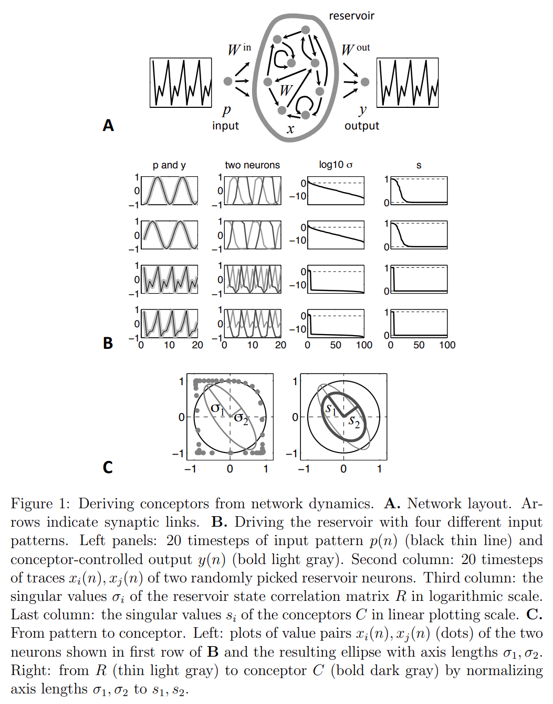
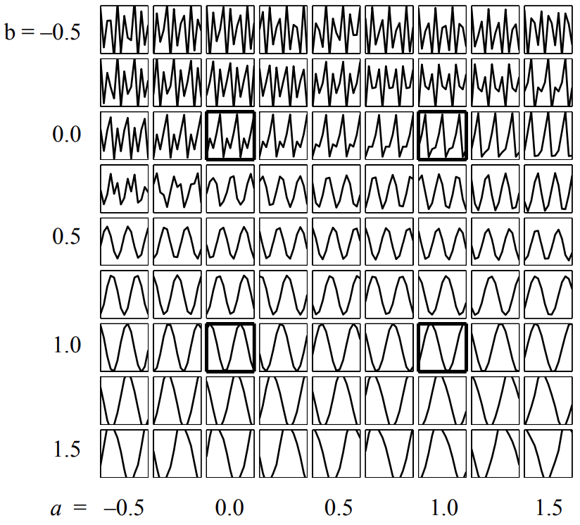

# Conceptor Examples

Here we document EchoTorch's examples using the Conceptor framework for pattern recognition and regeneration.

## Figures

This section list the various figures implemented in the examples which can be found in the original document 
"Controlling Recurrent Neural Networks by Conceptors".

### Figure 1 : Deriving conceptors from network dynamics

Original matlab file : fig1BC_SubspaceFirstDemo_Main

Example : [subspace_demo.py](https://github.com/nschaetti/EchoTorch/blob/dev/examples/conceptors/subspace_demo.py) : subspace 
demo with four patterns. This is a reproduction of figures 12, 13 and 15 ; 

### Figure 2 : Morphing between, and generalizing beyond, four loaded patterns

Example : [morphing_square.py](https://github.com/nschaetti/EchoTorch/blob/dev/examples/conceptors/morphing_square.py) :
morphing square demo with four patterns.

